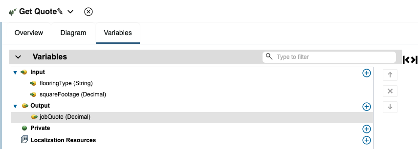
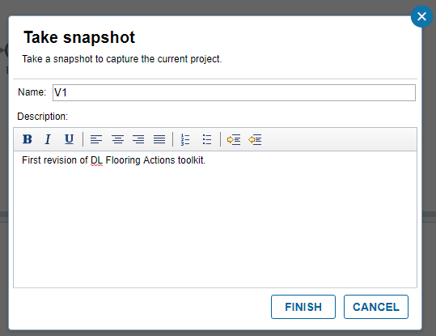

# The Provider: Creating actions and a template for the assembler to use.

In this part of the sample, the provider (a technical user) creates business-level actions for the assembler to use in their app. These actions are authored in a toolkit, allowing them to be reused in the future. The provider also creates a template as a starting point for app authoring.  The template specifies the starting point for the user interface of the app and which toolkits the app should reference.

1. Open BAStudio and ensure the view mode in the user preferences is set to advanced.


2. Go to the Toolkits panel and import "DL_UI_Toolkit - V1.twx".  This twx file has some business objects and corresponding views for building Apps in the DL Flooring company.
3. Create the DL Flooring Actions toolkit. 


4. Create an action called Get Quote. Action options can be found in the left library panel.
5. On the variables tab, create the input variables flooringType (String) and squareFootage (Decimal).  Create an output variable called jobQuote of type Decimal.



6. In the diagram, create a script activity. Rename the script to Calculate Quote and set the script to:
```javascript
if(tw.local.flooringType=="Hardwood"){
	tw.local.jobQuote = tw.local.squareFootage * 6;
} else if(tw.local.flooringType=="Tile"){
	tw.local.jobQuote = tw.local.squareFootage * 4;
} else{//carpet
	tw.local.jobQuote = tw.local.squareFootage * 2;
}
```
7. Wire the start node to the script activity, and the script activity to the End node. Click Finish editing.


8. Create a snapshot of the toolkit called V1.



9. Return to Studio and create a template called DL Flooring Template.


10. After the editor is opened, add DL Flooring Actions and DL UI Toolkit as toolkit dependencies.
11. In the App artifact, add DL Flooring Header to the first page. It can be found in the DL UI Toolkit or on the right side palette. Click Finish editing.


12. Create a snapshot of the template called V1.
