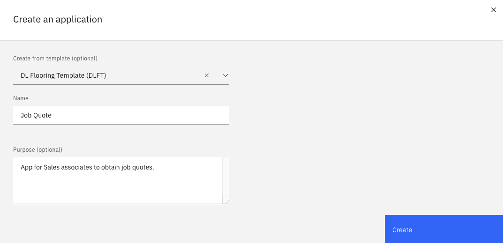
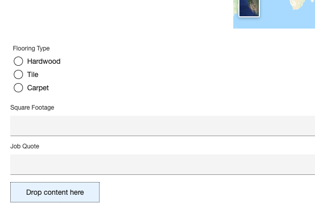
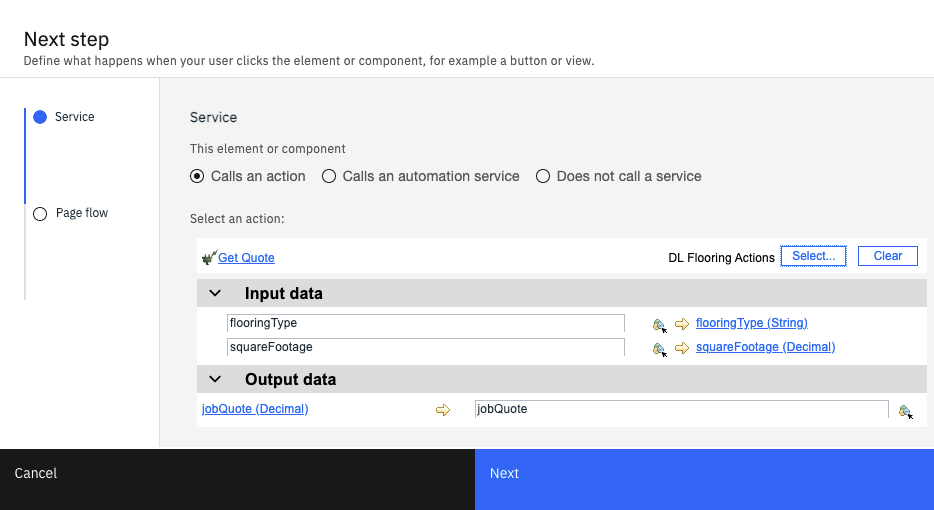
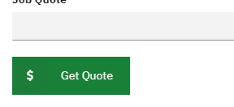
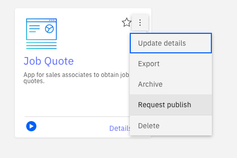
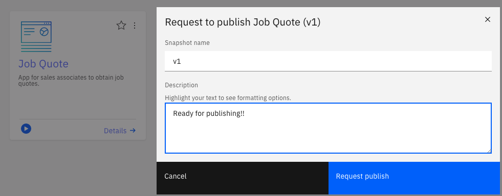

# The Assembler: Creating the Job Quote App

In this part of the sample, the assembler (a business developer) creates an App using a template as a starting point.

1. Open BAStudio and ensure the view mode in the user preferences is set to basic. 

2. If you haven't performed the Create Actions and Template steps, then import the "DL_Flooring_Template - V1.twx" file.
3. Go to the template panel and create an App based on the DL Flooring Template. Name the App Job Quote.

4. The editor is opened to the first page. Add the Location View by clicking in the upper "Add content here" area. 

5. In the Data mapping dialog, click "Select data" and choose to create a new variable. Set the variable name to "location".

6. Add an instance of the Flooring Type view under the location and create a new variable called flooringType for the data mapping.
7. Add a decimal control under the flooring type, set the label to "Square Footage" and create a new variable called squareFootage for the data mapping.
8. Add a decimal control under Square Footage, set the label to Job Quote and create a new variable called jobQuote for the data mapping.

9. Create a button in the bottom "Add content here" area.
10. In the Next step dialog that appears, call the Get Quote action. The inputs and outputs are automatically mapped.

11. Change the label of the button to "Get Quote" using the selection toolbar.

12. You may optionally change its color and set an icon.

13. Now that the App is fully authored, press the Test button in the top right corner to try it out. 
14. Once you are happy with how the app is running, return to studio.  Using the menu on the card, choose Request publish. Enter v1 for the snapshot name and complete the dialog so the administrator can publish the app into production.

