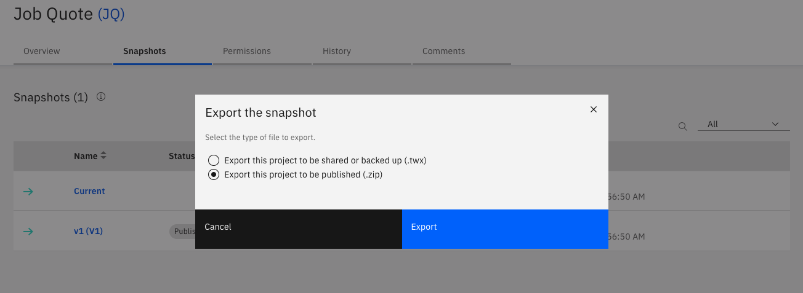
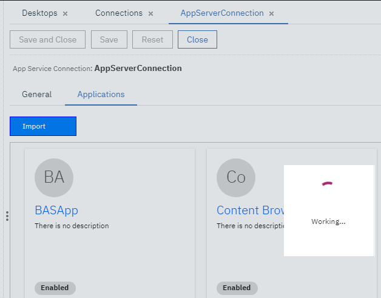
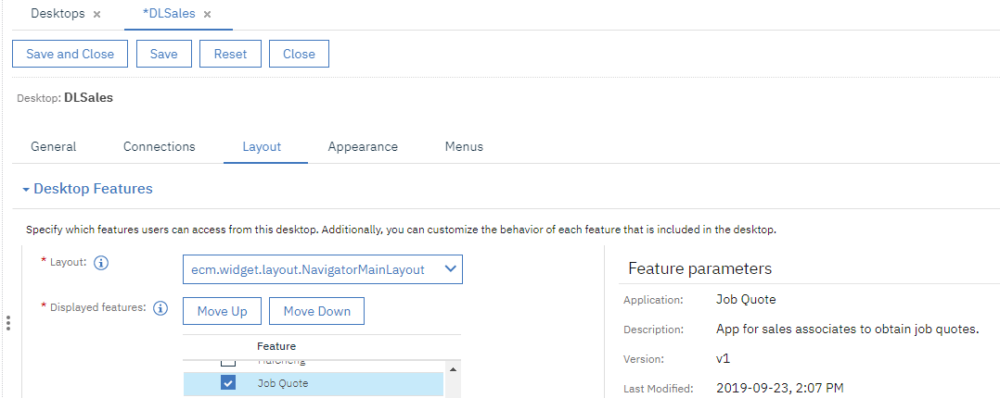

# The Administrator: Publishing the App for End Users to Consume

In this part of the sample, an administrator takes the app developed by the assembler and makes it available for end users.

1. Open BAStudio and ensure the view mode in the user preferences is set to advanced.
2. If you have not authored the Job Quote app, import Job_Quote - v1.twx.
3. Go into the details for Job Quote and choose the snapshots panel.
4. At the end of the v1 snapshot row, click Export.
5. In the dialog, choose Installation Package then complete the dialog.

6. Open Automation Navigator as an administrator in a browser.
7. Choose Administration, then choose Connections.
8. Select the connection for the app engine, then click Edit.
9. Select the "Connect..." button and enter the credentials for the app engine if necessary.  This will enable the Applications tab.
10. Select the Applications tab.
11. Click the Import button and choose the installation zip file that you obtained previously.

12. Now that the app is deployed on the app engine, you can add it to a desktop. Click Desktops and select the desktop in which you want to include the app.  Press the Edit button.
13. Select the Layout tab and you should see the app that you just deployed listed in the Displayed features section.  Select the app and save the desktop.

14. Reload the page as instructed and the app should show alongside all other apps.
15. Run the app by filling out the fields and trying out the various flooring types.
16. The App is now ready for end users to launch.
