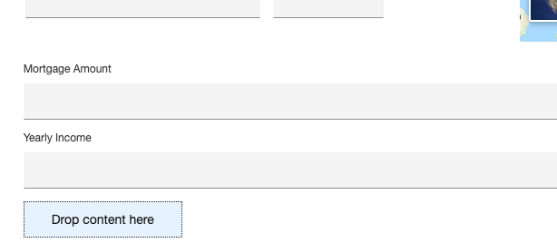
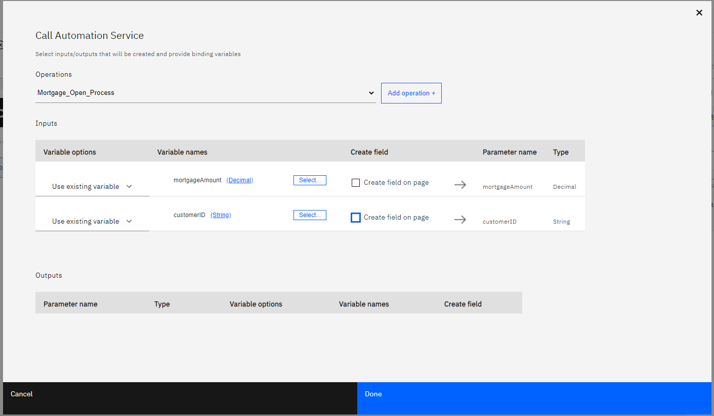
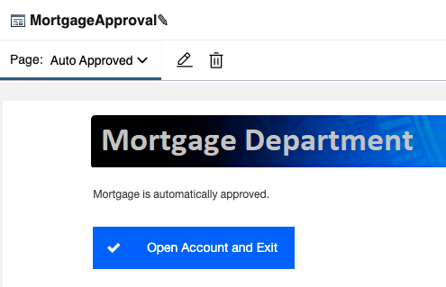
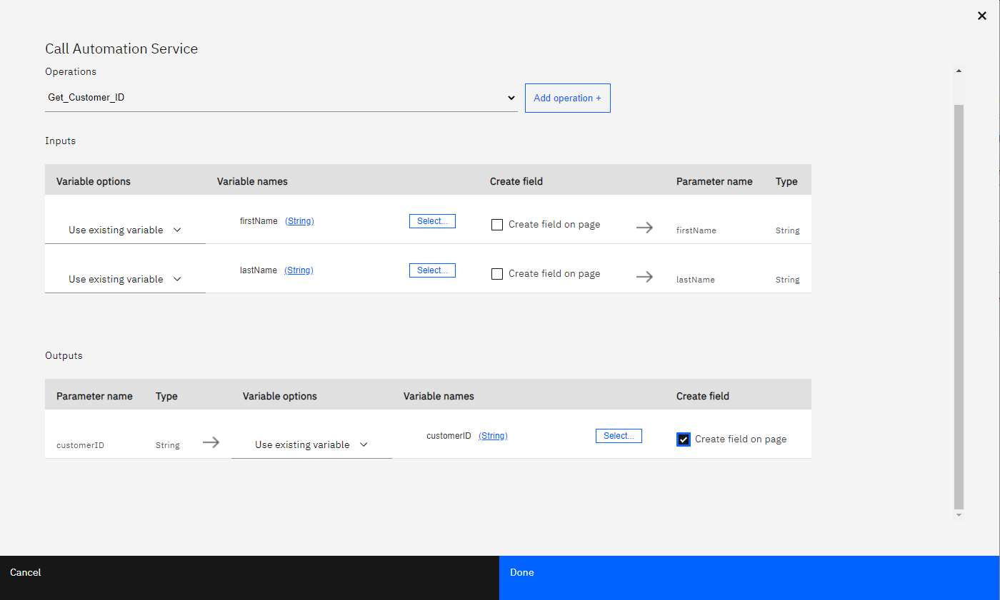
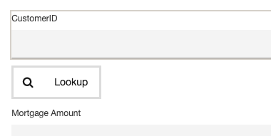

# The Assembler: Creating the Mortgage Approval App

In this part of the sample, the assembler (a business developer) creates an App leveraging a template as a starting point.
___
**Ensure you have the MortgagePA process app imported into Workflow as indicated [here](../README.md).**
___
1. Open BAStudio and ensure the view mode in the user preferences is set to basic. 

2. If you haven't performed the Create Actions and Template steps, then import the "MortgageAppTemplate - V1.twx" file.
3. Go to the template panel and create an App from the MortgageAppTemplate. Name the App MortgageApproval.

4. The editor is opened to the first page. Add the Customer View by dragging and dropping into the upper "Drop content here" area. In the Data association dialog, create a new variable and set the variable name to "customer".

5. Add a decimal control under the customer form, set the label to "Mortgage Amount" and create a new variable called mortgageAmount for the data association.
6. Add a decimal control under Mortgage Amount, set the label to Yearly Income and create a new variable called yearlyIncome for the data association.

7. Add a button to the bottom "Drop content here" area.
8. In the Next step dialog that appears, call the IsMortgageAutoApproved action. The inputs are automatically mapped.  For the output, choose a new variable called "isApproved".
9. Click the plus icon to create a branching path.
10. For the top path, select New Page and call it "Auto Approved".  Set condition to isApproved==true.
11. For the bottom path, select New Page and call it Risk Assessment. Complete the dialog.

12. Change the label of the button to "Next" using the selection toolbar.  You may optionally change its color and set an icon.

13. Go to the Auto Approved page and set the initial content to CreditDeptTempl.
14. Create Display Text with the content "Mortgage is automatically approved."
15. Create a button in the bottom content box. In the Next step dialog, set the action to "OpenMortgageAccount". The mortgage amount should be automatically mapped.  Create a new variable called customerID for the other input parameter. Choose &lt;end application&gt; for the "Go to page" setting.

16. Set the button label to "Open Account and Exit". You may optionally change its color and set an icon.

17. The customer ID variable is not being populated in the App yet, so go back to the Starting Page, add a Plain Text control under the customer form called "Customer ID". In the data association dialog, choose existing data as customerID.

18. Add a button under Customer ID and have it call the GetCustomerID action, mapping to the customer and customerID variables. After the action is called, we want to stay on the current page.

19. Change the button label to "Lookup". You may optionally change its color and set an icon.

20. Go to the Risk Assessment page and set the initial content to CreditDeptTempl.
21. We want to show the mortgage amount on this page, so the variable tab of the palette is used to select mortgageAmount.

22. Add an instance of Loan Risk Charts under the mortgage amount.
23. Add a button in the bottom content box. In the Next step dialog, set the action to "OpenMortgageAccount". Both inputs should be automatically mapped. Choose &lt;end application&gt; for the "Go to page" setting.
24. Set the button label to "Open Account and Exit". You may optionally change its color and set an icon.
25. Add another new button to the right of the other. Set it to go to &lt;end application&gt;.
26. Rename the button to Decline. You may optionally change its color and set an icon.

27. Now that the App is fully authored, press the Preview button in the top right corner to try it out. Use "Joe" as the first name for the customer ID lookup to work properly.
28. Once you are happy with how the app is running, return to studio.  Using the menu on the card, choose Request publish. Enter V1 for the snapshot name and complete the dialog so the administrator can publish the app into production.

