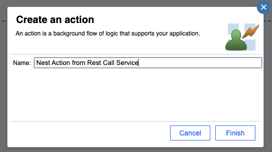

# A sample of steps to leverage Action Configurator to process a Swagger file

The Action Configurator in this sample is designed to process a Swagger file so that the Action defined in the Toolkit contribution in this sample can make REST calls by leveraging processed parameters. A sample swagger file is also included as a template of formats. 

1. Import "Rest_Call_Service_for_Swagger - v1.0.1.twx" and "Rest_Call_from_Swagger_Configurator - v1.2.4.twx".

2. Create a Template/App, import ```Rest Call Service for Swagger``` toolkit as a dependency. This can be done by clicking on the briefcase logo on the left library panel, and adding a Toolkit.


3. Create a new Action and then drag a Nested Action and drop onto the flow.



4. Open the Implementation tab, and select ```Rest Call Action for Swagger``` as a nested action and a ```Configure...``` button will appear. 


3. Click on the ```Configure...``` button, you can select a swagger file that you would like to process. On the next page, two single selects will let you choose an operation that you want make the REST call. 


4. After you finish configuration, Business Objects will be created based on ```definitions``` section in your swagger file and local variables will be generated baed on ```varTypeMap``` pre-defined in the Action Configurator. In the Data Mapping tab, all processed information will be mapped here using  generated local variables. Also, a defined endpoint entry will also be created so that host information and authentication can be configured here. 


5. At this point, you have finished configuration. All you need is to populate local variables in the main application flow. Below is merely an example but you don't have to follow it. Instead, local variables can be populated by scripts or even some other actions. 

